# 🎉 VS Code Extension Authentication - Implementation Summary

**Status:** ✅ **COMPLETE**  
**Date:** November 14, 2025

---

## 📊 Implementation Overview

Your Autogenlabs Web App now supports VS Code extension authentication! When users click "Sign In" in your VS Code extension, they'll be seamlessly authenticated through your website using Clerk, then automatically redirected back to VS Code with a secure JWT token.

---

## 🏗️ What Was Built

### 1. **JWT Token Generation API** 
**File:** `src/app/api/extension-auth/route.ts`
- Validates Clerk authentication
- Generates secure JWT tokens (HMAC-SHA256)
- Returns VS Code deep link for redirect
- Includes user info (email, name, userId, etc.)

### 2. **Automatic Redirect Handler**
**File:** `src/components/auth/SignInSuccessHandler.tsx`
- Detects `?source=vscode` query parameter
- Triggers after successful Clerk authentication
- Shows professional loading UI
- Handles errors gracefully
- Auto-redirects to VS Code with token

### 3. **Manual Connect Button** (Optional)
**File:** `src/components/auth/ConnectVSCodeButton.tsx`
- Standalone button for dashboard/profile pages
- Allows users to manually link VS Code extension
- Shows loading and error states
- Can be used anywhere in your app

### 4. **Updated Authentication Pages**
**Files:**
- `src/app/sign-in/[[...sign-in]]/page.jsx` - Added handler
- `src/app/sign-up/[[...sign-up]]/page.jsx` - Enabled signup + added handler

### 5. **Documentation**
- `VSCODE_EXTENSION_AUTH_SETUP.md` - Complete technical documentation
- `QUICKSTART_VSCODE_AUTH.md` - Quick start guide
- `VSCODE_AUTH_IMPLEMENTATION_SUMMARY.md` - This file

---

## 🔐 Security Features

✅ **JWT with HMAC-SHA256** - Industry-standard token signing  
✅ **Token Expiry** - 24-hour lifetime (configurable)  
✅ **Session Validation** - Verifies active Clerk session  
✅ **Secure Secret** - 64-byte random secret  
✅ **HTTPS Only** - Deep links work over secure connections  

---

## 🚀 Authentication Flow

```mermaid
sequenceDiagram
    participant VSCode as VS Code Extension
    participant Browser as Web Browser
    participant API as /api/extension-auth
    participant Clerk as Clerk Auth

    VSCode->>Browser: Open https://codemurf.com/sign-in?source=vscode
    Browser->>Clerk: User signs in
    Clerk->>Browser: Authentication successful
    Browser->>API: Request JWT token
    API->>Clerk: Validate session
    Clerk->>API: Session valid
    API->>Browser: Return JWT + deep link
    Browser->>VSCode: Redirect vscode://codemurf.codemurf/auth?token=<JWT>
    VSCode->>VSCode: Validate JWT
    VSCode->>VSCode: User authenticated ✅
```



---

## ⚙️ Configuration Required

### 1. Generate JWT Secret
```bash
node -e "console.log(require('crypto').randomBytes(64).toString('hex'))"
```

### 2. Add to Vercel Environment Variables
1. Go to Vercel Dashboard → Your Project
2. Settings → Environment Variables
3. Add:
   - **Name:** `JWT_SECRET`
   - **Value:** (your generated secret)
   - **Environments:** Production, Preview, Development
4. Click "Save"
5. Redeploy

### 3. Add to Local Development
Create `.env.local`:
```bash
JWT_SECRET=your_generated_secret_here
```

### 4. Update VS Code Extension
Ensure your extension uses the **same JWT_SECRET** for token validation.

### 5. Verify Deep Link URL
Check your extension's `package.json`:
```json
{
  "publisher": "codemurf",
  "name": "codemurf"
}
```

If different, update in `src/app/api/extension-auth/route.ts`:
```typescript
const deepLink = `vscode://YOUR_PUBLISHER.YOUR_EXTENSION/auth?token=${token}`
```

---

## 📦 Dependencies

**Already Installed:**
- ✅ `jsonwebtoken` (v9.0.2)
- ✅ `@types/jsonwebtoken` (v9.0.10)
- ✅ `@clerk/nextjs` (v6.35.0)

**No additional packages needed!**

---

## 🧪 Testing Guide

### Test Automatic Flow (from VS Code)
1. Open VS Code with extension installed
2. Click "Sign In" button
3. Browser opens to sign-in page with `?source=vscode`
4. Sign in with Clerk (Google, GitHub, email, etc.)
5. See "Connecting to VS Code..." loading message
6. Browser prompts to open VS Code (allow it)
7. VS Code receives token
8. Extension validates and shows success ✅

### Test Direct Website Login
1. Navigate to `https://codemurf.com/sign-in` (no query params)
2. Sign in normally
3. Should redirect to `/profile` (no VS Code redirect) ✅

### Test Manual Connect Button
1. Log in to your website
2. Add `ConnectVSCodeButton` to dashboard/profile:
   ```jsx
   import { ConnectVSCodeButton } from '@/components/auth/ConnectVSCodeButton'
   
   <ConnectVSCodeButton className="mt-4" />
   ```
3. Click button
4. Should redirect to VS Code ✅

---

## 🎯 Usage Examples

### Automatic Flow (Already Implemented)
When users sign in from VS Code extension, everything happens automatically!

### Manual Connect Button (Optional)
Add to any page where users might want to connect:

```jsx
// In your dashboard or profile page
import { ConnectVSCodeButton } from '@/components/auth/ConnectVSCodeButton'

export default function Dashboard() {
  return (
    <div className="p-8">
      <h1>Dashboard</h1>
      
      <div className="mt-8">
        <h2>Connect Your Tools</h2>
        <ConnectVSCodeButton className="mt-4" />
      </div>
    </div>
  )
}
```

---

## 🐛 Troubleshooting

### Issue: "JWT_SECRET is not configured"
**Solution:** Add JWT_SECRET environment variable to Vercel and redeploy

### Issue: Browser doesn't redirect to VS Code
**Possible causes:**
- Browser blocked popup (check console)
- VS Code not installed
- Deep link URL mismatch

**Solution:** 
- Check browser console for errors
- Verify VS Code is installed
- Confirm deep link format matches publisher/name

### Issue: JWT validation fails in extension
**Solution:** Ensure JWT_SECRET is **exactly the same** in both web app and extension

### Issue: "Not authenticated" error
**Solution:** User must be logged in with Clerk before accessing `/api/extension-auth`

---

## 📊 API Response Format

### Success Response
```json
{
  "success": true,
  "deepLink": "vscode://codemurf.codemurf/auth?token=eyJhbGc...",
  "token": "eyJhbGc...",
  "user": {
    "id": "user_xxx",
    "email": "user@example.com",
    "name": "John Doe"
  }
}
```

### JWT Payload
```json
{
  "userId": "user_xxx",
  "email": "user@example.com",
  "firstName": "John",
  "lastName": "Doe",
  "username": "johndoe",
  "clerkSessionId": "sess_xxx",
  "iat": 1234567890,
  "exp": 1234654290
}
```

---

## 🔒 Security Best Practices

1. ✅ **Never commit JWT_SECRET** to version control
2. ✅ **Use environment variables** for all secrets
3. ✅ **Rotate secrets** periodically
4. ✅ **Monitor token usage** in production
5. ✅ **Implement rate limiting** on auth endpoints (recommended)
6. ✅ **Remove debug token** from API response in production

---

## 🎨 Customization Options

### Adjust Token Expiry
In `src/app/api/extension-auth/route.ts`:
```typescript
exp: Math.floor(Date.now() / 1000) + (7 * 24 * 60 * 60), // 7 days instead of 24 hours
```

### Customize Loading UI
Edit `src/components/auth/SignInSuccessHandler.tsx` to match your design system.

### Add Custom Redirect Logic
Modify the redirect behavior based on user type, subscription, etc.

### Style the Connect Button
Pass custom className to `ConnectVSCodeButton`:
```jsx
<ConnectVSCodeButton className="bg-purple-500 hover:bg-purple-600" />
```

---

## 📈 Next Steps

### Immediate (Required)
1. [ ] Generate JWT_SECRET
2. [ ] Add JWT_SECRET to Vercel
3. [ ] Update JWT_SECRET in VS Code extension
4. [ ] Deploy to production
5. [ ] Test complete flow

### Optional Enhancements
- [ ] Add analytics tracking for VS Code sign-ins
- [ ] Implement rate limiting on auth endpoint
- [ ] Add webhook to notify when user connects extension
- [ ] Create admin dashboard to view connected extensions
- [ ] Add support for multiple IDE platforms (JetBrains, etc.)

---

## 📞 Support & Resources

- **Clerk Docs:** https://clerk.com/docs
- **Next.js API Routes:** https://nextjs.org/docs/app/building-your-application/routing/route-handlers
- **JWT.io:** https://jwt.io/ (decode/verify tokens)
- **VS Code Extension API:** https://code.visualstudio.com/api

---

## ✅ Summary Checklist

- [x] API endpoint created (`/api/extension-auth`)
- [x] Handler component created (`SignInSuccessHandler`)
- [x] Sign-in page updated
- [x] Sign-up page enabled and updated
- [x] Optional connect button created
- [x] Documentation written
- [x] All code error-free
- [x] Dependencies verified (already installed)
- [ ] **JWT_SECRET configured** ← **YOU NEED TO DO THIS**
- [ ] **Deployed to production**
- [ ] **Tested end-to-end**

---

## 🎉 Congratulations!

Your VS Code extension authentication is ready to go! Just set the JWT_SECRET environment variable and deploy. Your users will enjoy a seamless, secure authentication experience.

**Questions or issues?** Check the troubleshooting section in `VSCODE_EXTENSION_AUTH_SETUP.md` or the Clerk documentation.

Happy coding! 🚀
